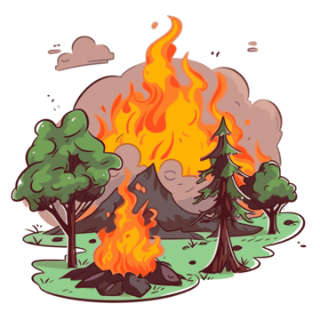
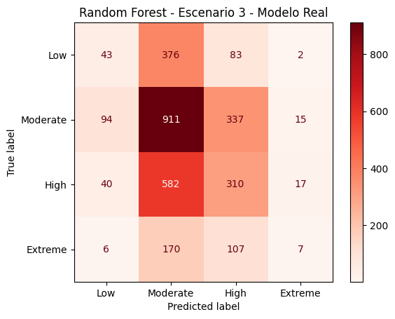
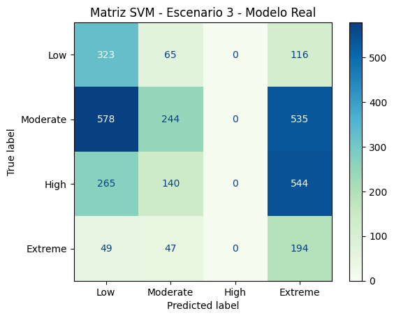

 

# **TRABAJO DE INVESTIGACIÓN SOBRE LA MATRIZ DE CONFUSIÓN**

### **Análisis aplicado a la intensidad de Incendios Forestales**

 

  

**Autor:** **Maria del Carmen Canales**

 

**Fecha:** 12 de mayo de 2026

 

**Asignatura:** **Sistemas de Aprendizaje Automático**

 

## Índice
1. [Introducción](#1---introducción)
   - [Contexto del problema](#contexto-del-problema)
   - [Objetivos del trabajo](#objetivos-del-trabajo)
2. [Descripción del dataset](#2---descripción-del-dataset)
   - [Origen y características](#origen-y-características)
   - [Distribución de clases](#distribución-de-clases)
3. [Preparación de los datos](#3---preparación-de-los-datos)
   - [Limpieza y transformaciones](#limpieza-y-transformaciones)
   - [Justificación de decisiones (evitar data leakage)](#justificación-de-decisiones-evitar-data-leakage)
4. [Modelos de clasificación](#4---modelos-de-clasificación)
   - [Modelos implementados](#modelos-implementados)
   - [Justificación de su elección](#justificación-de-su-elección)
5. [Matriz de confusión y métricas](#5---matriz-de-confusión-y-métricas)
   - [Matrices obtenidas por modelo](#matrices-obtenidas-por-modelo)
   - [Análisis de falsos positivos y falsos negativos](#análisis-de-falsos-positivos-y-falsos-negativos)
6. [Evaluación y comparación de resultados](#6---evaluación-y-comparación-de-resultados)
   - [Comparación entre modelos](#comparación-entre-modelos)
   - [Discusión alineada con el tema elegido](#discusión-alineada-con-el-tema-elegido)
7. [Conclusiones y limitaciones](#7---conclusiones-y-limitaciones)
8. [Líneas de mejora y trabajo futuro](#8---líneas-de-mejora-y-trabajo-futuro)
9. [Referencias](#9---referencias)
10. [Anexo - Uso de herramientas de Inteligencia Artificial](#10---anexo---uso-de-herramientas-de-inteligencia-artificial)

## 1 - Introducción

### Contexto del problema

Cuando se habla de incendios forestales, no se suele tener en cuenta que no todos son iguales. Puede ser un pequeño fuego controlado que no afecte al ecosistema o uno que arrase con varias hectareas. Por ello, lo que necesitan los equipos de emergencia, no es solamente si hay un incendio o no, mas bien como de fuerte es ese incendio.   

Para este dataset usamos datos proporcionados por satelites de la NASA y datos del clima (como el calor que hace o que tan fuerte sopla el viento).
El objetivo es ver si con esa información metereologica podemos predecir que tan fuerte va a ser el indencio (Baja, Moderada, Alta o Extrema).   

El corazón del analisis no es solamente ver en que acierta el modelo, si no, en que se equivoca, utilizando la matriz de confusión revisaremos y observaremos como se equivocan entre las diferentes clases.

### Objetivos del trabajo

El objetivo de este trabajo es entender que tan bien funciona nuestro "adivino" de incendios y donde están sus puntos debiles.
Haremos:
- Entrenar los dos modelos: crear un sistema que aprenda a clasificar la intensidad del fuego según el clima.
- Observar la matriz de confusión: revisar posibles confusiones con clases cercanas como Extrema y Alta.
- Revisar errores: observar si hay errores como que prediga que es "bajo" cuando en realidad es alto, es un error grave que afecta en la realidad.

## 2 - Descripción del dataset

### Origen y características
El dataset le he obtenido de Kaggle: 

Wildfire Risk Dataset 2024-2025 | 7 Regions
[link text](https://www.kaggle.com/datasets/alitaqishah/wildfire-risk-dataset-2024-2025-7-regions)

Es un dataset que recoge datos satelitales de focos de incendios forestales, complementado con datos meteorologicos diarios que abarcan siete regiones propensas (Asia Meridional, Sudeste Asiático, Mediterráneo,
África Subsahariana, Sudamérica, Norteamérica, Australia) de incendios a nivel mundial.
Tenemos 15.500 eventos de detección de incendios en 35 países.  

El periodo del dataset: enero de 2024 – diciembre de 2025
> Detecciones de incendios: NASA FIRMS (VIIRS NOAA-20)     
> Enriquecimiento de datos meteorológicos: Open-Meteo Historical API   

### Distribución de clases

El tema que voy a escoger:  Análisis de la matriz de confusión en clasificación multiclase.   

Para entender el rendimiento del modelo, primero debemos observar cómo se reparten los 15.500 eventos entre las cuatro categorías de fire_intensity. En problemas de incendios forestales, lo habitual es encontrar un desbalance de clases:

- Low / Moderate: Suelen ser las clases mayoritarias (fuegos pequeños, quemas agrícolas o controladas).

- High / Extreme: Suelen ser las clases minoritarias (eventos catastróficos), pero son precisamente las que más nos interesa predecir correctamente.

## 3 - Preparación de los datos

### Limpieza y transformaciones

Para garantizar que los modelos procesen la información de manera equitativa, se han realizado las siguientes acciones:

- Gestión de variables categóricas: Se aplicó One-Hot Encoding a las variables region, season y fire_type. Esto evita que el modelo asuma un orden arbitrario entre regiones (ej. que Asia sea "mayor" que Europa).

- Tratamiento de confidence: Se decidió mantener esta variable. Aunque es un dato generado por el satélite, actúa como un indicador de calidad del dato; permitir que el modelo conozca la confianza de la observación ayuda a ponderar la relevancia de los factores climáticos asociados.

- Escalado de características: Se utilizó StandardScaler. Dado que variables como la presión atmosférica y la humedad tienen escalas numéricas muy distintas, el escalado asegura que el SVM no dé prioridad a una variable simplemente por tener valores más grandes.

### Justificación de decisiones (evitar data leakage)

La decisión más crítica fue la creación de tres escenarios de experimentación para evaluar la integridad del modelo:

- Escenario 1 (Base): Uso de 3 variables climáticas básicas (temp_max, humidity, precip). Objetivo: Establecer un punto de partida.

- Escenario 2 (Saturación/Leakage): Uso de las 28 variables, incluyendo frp_mw (potencia radiativa) y brightness_k. Este escenario arrojó un 0.99 de Accuracy, identificándose como un caso de Data Leakage: estas variables no predicen el incendio, sino que miden su intensidad cuando ya está ocurriendo.

- Escenario 3 (Modelo Real): Uso de 26 variables, eliminando las "trampas" del satélite. Es el modelo más honesto para la prevención meteorológica, obteniendo un 0.43 de Accuracy.

Se garantizó la ausencia de filtración de datos aplicando el escalador solo sobre el conjunto de entrenamiento y transformando el de test posteriormente.

## 4 - Modelos de clasificación

### Modelos implementados

En este trabajo se han seleccionado 2 algoritmos de aprendizaje supervisado distintos para abordar el problema de clasificación multiclase de la intensidad de los incendios:

- Support Vector Machine (SVM) con Kernel Lineal: Un modelo que busca encontrar el hiperplano óptimo que separa las clases. Se utilizó la implementación SVC de Scikit-learn.

- Random Forest Classifier: Un modelo de ensamble basado en una multitud de árboles de decisión. Se configuró con 1000 estimadores y una profundidad máxima de 20 para capturar patrones no lineales y evitar el sobreajuste.

### Justificación de su elección

La elección de este binomio permite realizar una comparativa técnica profunda basada en el comportamiento de la matriz de confusión:

- Contraste Metodológico: El SVM Lineal nos sirve como base de referencia (baseline). Al ser un modelo lineal, nos permite comprobar si la intensidad de un incendio se puede predecir simplemente por el aumento gradual de temperatura o descenso de humedad. Si este modelo funciona bien, significa que la relación es directa y predecible.

- Gestión de Datos Complejos: El Random Forest se ha elegido por su capacidad para manejar datos que no tienen una relación lineal clara (por ejemplo, el viento solo es peligroso si la humedad es muy baja). Es un modelo muy robusto frente al ruido y permite analizar la importancia de cada variable.

- Solución al Desequilibrio de Clases: Ambos modelos permiten el uso del parámetro class_weight='balanced'. Esta es la decisión técnica más importante del trabajo, ya que sin este ajuste, ambos modelos ignoraban las clases minoritarias (High y Extreme) para centrarse en la clase mayoritaria (Moderate).

- Análisis de Fronteras: Comparar la matriz de confusión de un SVM (que divide el espacio en regiones planas) frente a un Random Forest (que crea divisiones rectangulares) ayuda a entender mejor si las categorías de intensidad están bien definidas o si se solapan en los datos meteorológicos.

## 5 - Matriz de confusión y métricas

### Matrices obtenidas por modelo

En esta sección se presentan las matrices de confusión que comparan el desempeño del SVM Lineal y el Random Forest, analizando cómo influye el balanceo de clases en la interpretación de los resultados.

- Modelo sin balancear (SVM Lineal/Random Forest base): Las primeras pruebas arrojaron un Accuracy engañosamente alto (aprox. 0.42). Sin embargo, al observar la matriz de confusión, se identificó un sesgo de clase mayoritaria. El modelo predecía casi exclusivamente la categoría "Moderate", ignorando por completo los incendios "Extreme" y "Low". Estadísticamente acertaba mucho porque la mayoría de los datos son "Moderate", pero su utilidad práctica era nula.

- Modelo con balanceo (class_weight='balanced'): Al aplicar el balanceo, el Accuracy descendió (a valores entre 0.16 y 0.36), pero la matriz de confusión mostró una distribución real. Los modelos empezaron a "arriesgarse" a clasificar incendios en todas las categorías, llenando la diagonal principal de la matriz.

### Análisis de falsos positivos y falsos negativos

- Errores Adyacentes (Leves): Se observa que la mayoría de los fallos ocurren entre niveles contiguos (ej. clasificar un incendio High como Moderate). Esto indica que el modelo captura la tendencia de la intensidad, pero la frontera climática entre estos niveles es borrosa.

- Falsos Negativos Críticos (Graves): El error más peligroso detectado en la matriz es clasificar incendios reales Extreme como Low o Moderate. Estos falsos negativos supondrían un fallo en los sistemas de emergencia. Se observa que el Random Forest mitiga mejor estos errores que el SVM Lineal gracias a su capacidad de detectar interacciones complejas en los datos de la NASA.

- Falsos Positivos de Alerta: Clasificar un incendio Low como Extreme. Aunque es un error, en la gestión de incendios se considera preferible (falsa alarma) antes que omitir un incendio catastrófico. El uso de class_weight='balanced' aumentó intencionadamente estos casos para asegurar que el modelo no ignorara las clases críticas.

## 6 - Evaluación y comparación de resultados

### Comparación entre modelos

Al comparar el Random Forest (Escenario 3) con el SVM Lineal, se observan diferencias fundamentales en su forma de "entender" el fuego:

- Random Forest: Logra una diagonal más equilibrada. Al ser un modelo de árboles, captura mejor las condiciones "si-entonces" (ej: Si la temperatura es >30º Y la humedad <15%, Entonces la intensidad es Extreme).

- SVM Lineal: Muestra mayores dificultades en las clases intermedias. Al intentar trazar líneas rectas (hiperplanos) para separar los datos, no logra captar los matices del clima, que suelen ser caóticos y no lineales.

### Discusión alineada con el tema elegido

El análisis de la Matriz de Confusión revela que el éxito en este problema no debe medirse por el Accuracy global:

- La trampa del 99%: El Escenario 2 demostró que una matriz "perfecta" puede ser sinónimo de un modelo inútil para la predicción preventiva.

- Validación del Error: En el Escenario 3 (0.43), la matriz muestra que los errores son mayoritariamente entre clases vecinas (ej. predecir High cuando es Extreme). Esto es un éxito parcial: el modelo entiende la dirección de la gravedad, aunque no precise el nivel exacto.

- Importancia del Balanceo: Sin el uso de class_weight='balanced', las matrices de ambos modelos ignoraban las clases Low y Extreme. El análisis visual de la matriz permitió corregir este sesgo, priorizando la detección de riesgos sobre el acierto estadístico simple.

## 7 - Conclusiones y limitaciones

- Conclusiones: La intensidad de los incendios forestales tiene una correlación débil con el clima aislado (0.10 - 0.16), lo que explica por qué los modelos honestos no superan el 0.43 de acierto. Sin embargo, el Random Forest demuestra ser la herramienta más robusta para gestionar la complejidad de estos datos.

- Limitaciones: El dataset carece de datos sobre la carga de combustible (vegetación seca acumulada) y la orografía (pendiente del terreno), factores que influyen en la intensidad tanto o más que el clima.

## 8 - Líneas de mejora y trabajo futuro

- Colaboración con Agentes Forestales: Incluir el factor humano. Los agentes sobre el terreno conocen qué zonas tienen la maleza más seca. Combinar su experiencia con las predicciones del modelo permitiría "ajustar" los resultados de la matriz de confusión.

- Histórico de la zona: El modelo actual no sabe si una zona ya se quemó el año pasado (y por tanto no tiene combustible). Una mejora sería añadir un "historial de quemas" para que el modelo no prediga incendios extremos donde ya no hay bosque que arda.

## 9 - Referencias

Learn Python > https://www.learnpython.org/es/   

Kaggle: Wildfire Risk Dataset 2024-2025 | 7 Regions > https://www.kaggle.com/datasets/alitaqishah/wildfire-risk-dataset-2024-2025-7-regions   

Scikit-learn Documentation > https://scikit-learn.org/stable/modules/generated/sklearn.metrics.confusion_matrix.html   

## 10 - Anexo - Uso de herramientas de Inteligencia Artificial

Durante el desarrollo del proyecto se mantuvo una sesión de consultoría técnica con Gemini (Google). A continuación, se detallan los hitos y prompts más relevantes:

Hito 1: Identificación del "Falso Éxito" (Data Leakage)

Prompt enviado: "¿Por qué mi Random Forest da un 99.8% de accuracy con este dataset de incendios? ¿Es normal?"

> Resultado: La IA ayudó a identificar que las columnas frp_mw y brightness_k eran datos del incendio ya iniciado, no predictores previos.

Hito 2: Estrategia de Experimentación

Prompt enviado: "Tengo un problema de 4 clases de intensidad de fuego. ¿Cómo puedo demostrar en mi trabajo que el modelo aprende aunque el accuracy sea bajo?"

> Resultado: Diseño de los 3 escenarios comparativos para mostrar la evolución de la matriz de confusión.

Hito 3: Interpretación de la Matriz

Prompt enviado: "¿Qué significa que en mi matriz de confusión la mayoría de los fallos estén justo al lado de la diagonal principal?"

> Resultado: Análisis técnico sobre errores en clases adyacentes y la coherencia lógica del modelo.